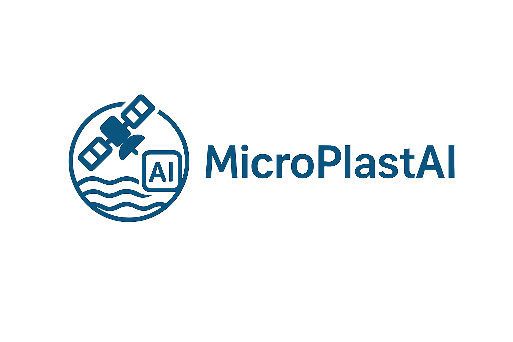

# UNU-Global-Youth-AI-Future-Innovation-Competition
## MicroPlastAI

## Overview
**MicroPlastAI** is an AI-driven solution designed to detect and analyze microplastic pollution in marine environments. By leveraging advanced machine learning and computer vision techniques, our project aims to provide actionable insights for environmental protection and sustainable ocean management.

This project is developed for the **UNU Global Youth AI Future Innovation Competition**.

## Features
- Automated detection of microplastics from images and datasets
- Quantitative analysis of microplastic distribution
- User-friendly interface for visualizing pollution hotspots
- Supports integration with large-scale environmental datasets

## Attention
If you cannot have access the notebook via GitHub, this is about GitHub. Please try to download it.

## LICENSE
Please read the license.

## About the User Interface 

Since sales have not started yet, the user interface codes are hidden.
